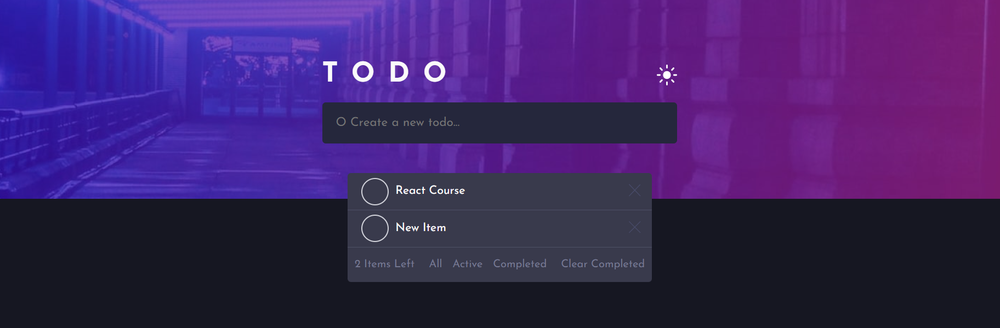

# Todo List + Local Storage Frontend Mentor Challenge 
This proyect was created with the purpose of using/practice HTML+CSS+JS

## Main Page

## Main Page Light Theme

## Adding Items to the List

## Number of items Left

## Check Item

When we click into the CheckBox, the item will be cross and be set as complete, we can see it if we click into the Completed button

## Completed Items

All the completed items will be showed here

## Active Items

If we click the Active Button it will show all the Active Items that needs to be done

## All Items

Then if we want to see all the items we click the All button, showing all the items (active and completed)

## Clear Completed

Also with all the completed items, we can delete from the list with the Clear Completed button 

## Remove an Item

And finally if we decide to remove an item, we just click the X on the right side

## Light Theme

## LocalStorage w/ Theme Mode
When we reload the page the items that we added previously will be there, aswell the theme if it is Dark or Light

